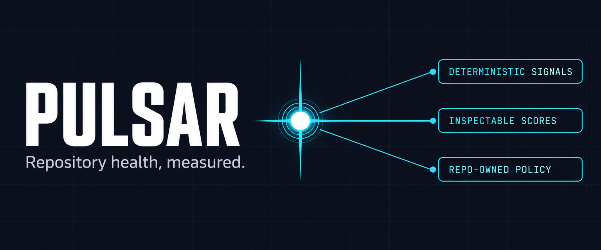
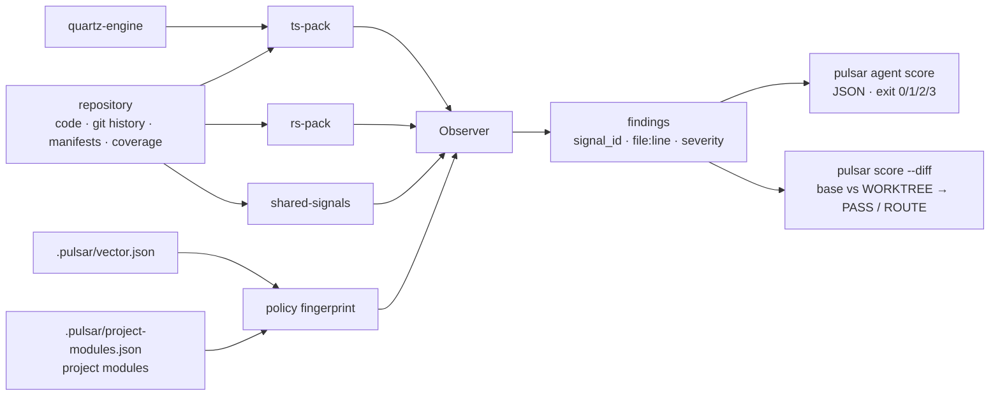

<p align="center">
  
</p>

<h1 align="center">Pulsar</h1>

<p align="center"><strong>Pulsar scores a repository and each agent diff under one shared policy.</strong></p>

<p align="center">
  <code>npx @skastr0/pulsar agent score .</code>
  ·
  <a href="https://www.npmjs.com/package/@skastr0/pulsar">npm</a>
</p>

## The pain

An agent says the change is done. Typecheck is clean and the tests pass.

- **The diff can still be wrong in ways no test covers:** a `catch` that returns `{}`, a validator that always returns `true`, a `@ts-ignore` with no reason.
- **Checking it means reading every line.** With several agents in one repo, that's the job you were handing off.
- **A whole-repo score hides one bad change** inside an average that still looks fine.

Pulsar scores the diff against the policy your repository has committed and lists what the change introduced, by file and line.

**Status:** usable with gaps · v0.2.1 · macOS and Linux (arm64, x64) · [gaps](#status)

## An agent's diff, scored

An agent adds `src/search/cache.ts` to a TypeScript repository. Typecheck is clean and all 351 tests pass.

```ts
import { readFileSync } from "node:fs"

export function loadSearchCache(path: string): Record<string, unknown> {
  try {
    const raw = readFileSync(path, "utf8")
    // @ts-ignore
    return JSON.parse(raw) as any
  } catch (e) {
    return {}
  }
}

export function validateSearchCache(cache: Record<string, unknown>): boolean {
  // TODO: implement real validation
  return true
}
```

```console
$ npx @skastr0/pulsar score --diff HEAD..WORKTREE --changed-only --agent-view .
Pulsar Agent View: ROUTE
Range: HEAD..WORKTREE
Changed files: 1
Introduced diagnostics: 7
Changed-scope diagnostics: 6
- 6 introduced diagnostic(s) need review routing.
TS-AB-02-unused-exports WARN Export loadSearchCache in src/search/cache.ts: unused
TS-AB-02-unused-exports WARN Export validateSearchCache in src/search/cache.ts: unused
TS-LD-07-unsafe-type-erosion INFO Unsafe `any` in assertion `<expression>`
  at src/search/cache.ts:7
TS-LD-09-error-channel-opacity WARN Catch fallback hides error channel in boundary `loadSearchCache`
  at src/search/cache.ts:8
  fix: Expose the failure contract (medium)
TS-SL-03-suppressions WARN ts-ignore is missing justification
  at src/search/cache.ts:6
TS-SL-06-confidence-claim-mismatch WARN validateSearchCache claims runtime validation; supporting behavior: none; observed behavior: unconditional success; ...
  at src/search/cache.ts:13
  fix: Make the claim true or rename it (medium)
```

`ROUTE` means the change introduced findings someone should look at. `PASS` means it introduced none in the changed files.

## Is / is not

| Pulsar **is** | Pulsar **is not** |
|---|---|
| Deterministic: same code and same policy give the same score | A model reviewer. It needs no account and no API key |
| One policy per repository, committed in `.pulsar/` | A personal preference profile |
| A check an agent can run and parse: JSON, exit codes, file and line | A linter replacement or a security audit |
| 74 signals: 38 TypeScript, 24 Rust, 12 from git history and manifests | Windows-ready: there is no Windows binary yet |

## Quick start

No config needed. Run inside the repository you want to score. `bunx @skastr0/pulsar` works the same as `npx` (Node 18 or newer).

```bash
# 1. Score the whole repository under the built-in defaults
npx @skastr0/pulsar agent score .

# 2. Score only what your uncommitted changes introduced
npx @skastr0/pulsar score --diff HEAD..WORKTREE --changed-only --agent-view .

# 3. Record the policy fingerprint you are scoring under (uses jq)
npx @skastr0/pulsar agent config . | jq -r .result.policy.fingerprint

# 4. After a fix, score again and refuse the comparison if the policy changed
npx @skastr0/pulsar agent score --expect-policy <fingerprint> .
```

Step 1 prints one JSON document. Trimmed:

```json
{ "schema": "pulsar/agent/v1alpha1", "operation": "score", "status": "completed",
  "result": {
    "policy": { "fingerprint": "d654fb01c258…", "vector": { "source_label": "built-in defaults" } },
    "assessment": {
      "hard_gate_status": "pass",
      "readiness": { "score": 0.676884830859, "status": "yellow" },
      "counts": { "applicable": 34, "not_applicable": 9, "insufficient_evidence": 29, "failed": 0 } },
    "findings": [
      { "signal_id": "TS-LD-02-function-size-distribution", "severity": "warn",
        "message": "Function outlier `collectFacts/Effect.gen` — 147 LOC",
        "location": { "file": "src/facts/lint.ts", "line": 378 } } ] } }
```

| Exit code | `agent score` means |
|---|---|
| 0 | Complete |
| 1 | Invalid input, config, or policy |
| 2 | A proven hard-gate violation |
| 3 | Incomplete evidence. The JSON still carries every finding |

`score --diff` exits 0 whether it prints `PASS` or `ROUTE`. To gate a script on it, read the verdict from JSON:

```console
$ npx @skastr0/pulsar score --diff HEAD..WORKTREE --changed-only --json . | jq -r .gate_decision.status
route
```

### Loosening the rules does not count as a fix

If the policy changes between two runs, step 4 refuses to compare them:

```console
$ npx @skastr0/pulsar persona apply strict-type-safety --to .pulsar/vector.json
$ npx @skastr0/pulsar agent score --expect-policy d654fb01c258a9397d03d596be30452437bda2c30d207c278833a26a51c5ec67 .
{"status":"error","error":{"code":"POLICY_MISMATCH",
 "message":"The assessment policy changed; this run cannot verify a repair under the expected policy."}}
```

## How it works



Signal packs read the repository: TypeScript through [quartz](https://github.com/skastr0/quartz), Rust, and language-agnostic signals over git history, manifests, and coverage reports. The Observer runs them under the repository's policy. The policy is `.pulsar/vector.json` plus optional project modules, and it hashes to one fingerprint. `score --diff` runs the Observer on the base commit and on the working tree and reports only what the change introduced. Each signal has a provability tier that caps how hard it can enforce, so only signals with proof behind them can fail the hard gate.

## Make the policy yours

Optional. Everything lives in `.pulsar/`, which you commit.

| To | Run |
|---|---|
| See every signal, weight, and calibration slot | `npx @skastr0/pulsar agent catalog .` |
| Start from a preset | `npx @skastr0/pulsar persona apply strict-type-safety --to .pulsar/vector.json` |
| List presets | `npx @skastr0/pulsar persona list` |
| Check a policy change before scoring | `npx @skastr0/pulsar agent config .` |

The presets are `ai-slop-defense`, `domain-purist`, `refactor-friendly`, `security-paranoid`, `strict-type-safety`, and `velocity-first`. A preset changes nothing until you apply it. For weights, project modules, and the policy files, see [calibration](docs/calibration.md).

## Where it fits

When several agents work in one repository, Pulsar is the check they all run against the same committed policy before they call a change done. More at [castro.engineer/projects/pulsar](https://castro.engineer/projects/pulsar).

## Reference

- [Signals](docs/signals/catalog.md): all 74, what each measures, and provability tiers
- [Calibration and policy](docs/calibration.md): vectors, presets, project modules, the agent protocol, and packages
- [Agent guide](docs/agent-first.md): the catalog → config → score → repair loop, end to end
- [Project modules](docs/project-modules.md): executable calibration with the SDK
- [Changelog](CHANGELOG.md)

## Status

Usable with gaps. v0.2.1 on npm. The agent JSON schema is `v1alpha1` and may change.

- `score --diff` exits 0 on `ROUTE`. Gate on `gate_decision.status` as shown above.
- A stray file in another language leaves those signals without evidence. For example, one `.rs` file in a TypeScript repo leaves 21 Rust signals at `insufficient_evidence`, and `agent score` exits 3.
- TS-AD-04 fails on some repositories. Scoring a repository the size of Effect can use more than 4 GiB of memory. See [CHANGELOG](CHANGELOG.md).
- There are no Windows binaries.

## Contributing, security, license

- Development: Bun 1.3.14, then `bun install --frozen-lockfile && bun run verify`. New signals follow [signal authoring](docs/signals/authoring.md).
- Bugs and scoped proposals: [issues](https://github.com/skastr0/pulsar/issues). See [CONTRIBUTING.md](CONTRIBUTING.md) and [SUPPORT.md](SUPPORT.md).
- Report vulnerabilities privately: [SECURITY.md](SECURITY.md).
- [MIT](LICENSE).
